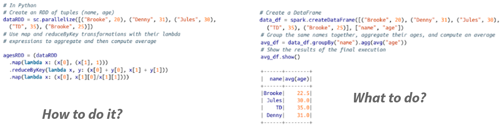
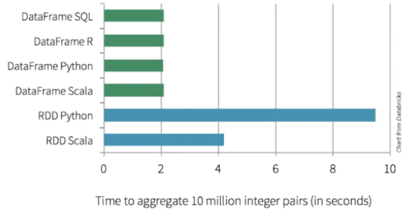
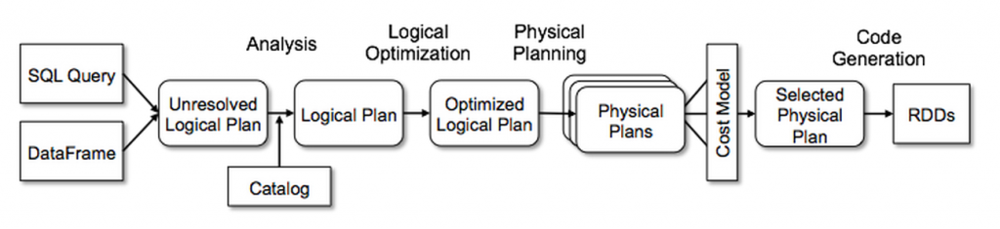

# SparkSQL & DataFrames

## RDDs: Pros and Cons

- Pros
  - Developers: **low level control** of execution
- Cons
  - For user
    - **complicated** to express complex ideas
    - **difficult** to understand the code
  - For Spark: lambda functions are **opaque** (no optimization)

## DataFrames

- Structured dataset:
  - In-memory, distributed tables
  - Named and typed columns: schema
  - Collection of **Rows**
- Sources available: structured files, Hive tables, RDBMS (MySQL, PostgreSQL, …), RDDs
- High-level APIs

## RDDs vs DataFrames

### Code



### Performance



### Catalyst optimizer



## Working with DataFrames

Using **chaining** functions

```python
df
  .select(...)
  .filter(...)
```

Writing **SQL strings**

```python
spark.sql("SELECT * FROM table")
```

## Why SQL?

- Around since the 70s
- Huge enterprise usage:
  - Lots of users
  - Lots of projects
- But: cannot be used for ML or graph analyses

---

*The content of this document, including all text, images, and associated materials, is the exclusive property of Adaltas and is protected by applicable copyright laws. Unauthorized distribution, reproduction, or sharing of this content, in whole or in part, is strictly prohibited without the express written consent of the author(s). Any violation of this restriction may result in legal action and the imposition of penalties as prescribed by law.*
